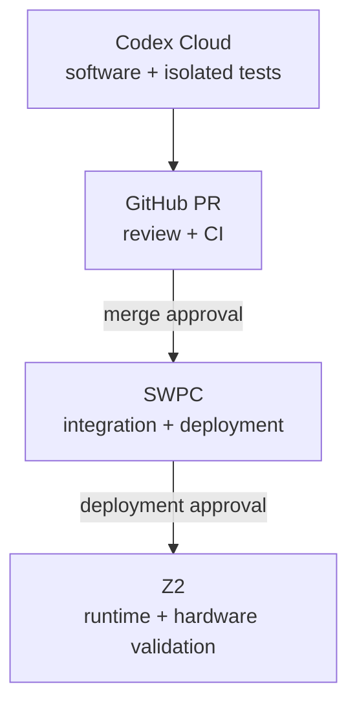

# Plasma Codex Cloud 工作環境

> Repository：`physicslu/plasma`
>
> 環境名稱：`plasma-software`
>
> 適用範圍：軟體開發、隔離測試、feature branch 與 Pull Request

## 1. 執行環境責任邊界

| 環境 | 角色 | 可驗證 | 不可據此宣稱 |
|---|---|---|---|
| Codex Cloud | Software engineering agent | Python、Web、Mock、PL source layout、文件、diff | SWPC 已部署、Vivado 成功、Z2 正常、實體 IC 燒錄成功 |
| SWPC | Integration / deployment server | 跨 stack 測試、Vivado、systemd 服務、部署與 health check | Z2 電氣與實體 target 已驗證 |
| Z2 | Target runtime / hardware validation | Embedded Linux、PS/PL、FPGA I/O、OpenOCD/SWD、實體 target | 尚未實際執行的量產條件 |

核心原則：測試結果只能向上證明本環境實際觀察到的事實，不能跨環境推論。

## 2. Codex Cloud 設定

在 Codex 的 Environment settings 建立環境：

| 欄位 | 設定值 |
|---|---|
| Name | `plasma-software` |
| Repository | `physicslu/plasma` |
| Base image | `universal` |
| Python | `3.11` |
| Node.js | `22.13.0` |
| Setup script | `bash scripts/codex-cloud-setup.sh` |
| Maintenance script | `bash scripts/codex-cloud-maintenance.sh` |
| Environment variables | 不需要 |
| Secrets | 不需要 |
| Agent Internet access | 預設關閉；目前測試不需要 |

依賴下載發生在 setup／maintenance 階段。GitHub repository 的 checkout、branch 與
Pull Request 由 Codex GitHub 連線處理，不要另外放入 Personal Access Token。

若 `pyproject.toml`、`package.json`、`package-lock.json` 或 setup script 改變，應讓
Codex 重新建置 cache；不要用舊 cache 的測試結果代表新 dependency graph。

## 3. Cloud 驗證入口

Environment setup 完成後執行：

```bash
bash scripts/codex-cloud-test.sh
```

這個入口會依序執行：

1. 單一 `pytest` runner 收集 Python 與不需要 Vivado 的 PL source-layout tests。
2. Web lint。
3. Web build 與 Node tests。
4. Sites artifact validation。

Cloud 不執行 `plasmactl deploy`、systemd restart、Vivado bitstream build、Z2 overlay
載入、DUT power control 或實體 IC programming。

## 4. 交付流程



標準流程：

1. Codex Cloud 從 `main` 建立 `agent/<feature>` branch。
2. 完成軟體修改並執行 `scripts/codex-cloud-test.sh`。
3. 推送 branch、建立 PR、等待 GitHub Actions。
4. 使用者批准 merge 後，才整合到 `main`。
5. 使用者批准部署後，SWPC 執行 `plasmactl deploy`。
6. 需要硬體的功能另在 Z2 執行驗證，結果回填 PR／測試報告。

## 5. 安全與隔離規則

- Codex Cloud 不保存 SWPC SSH private key、Z2 credentials、板卡憑證或部署 token。
- 不把 SWPC 或 Z2 內部服務暴露到公開網路，來讓 Cloud 直接呼叫硬體。
- Mock 成功只代表 software control flow 成功。
- Vivado 未執行時，不得宣稱 synthesis、implementation 或 bitstream 成功。
- Z2 未實測時，不得宣稱 PS/PL、SWD、電源控制或實體 target 成功。
- Merge、部署、service restart 與 hardware-affecting action 仍是獨立批准閘門。
