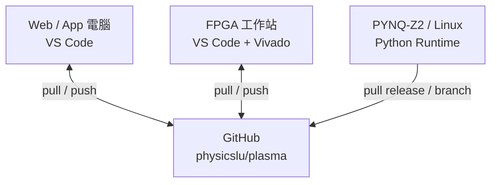

# Plasma 多電腦開發與 GitHub 同步指南

> 專案：`physicslu/plasma`<br>
> 適用：Web／未來 App／FPGA PL／Python／Embedded Linux<br>
> 工具：VS Code、Git Command Line、Vivado<br>
> 文件格式：HackMD 相容 Markdown<br>
> 更新日期：2026-08-13

###### tags: `Plasma` `GitHub` `VS Code` `Vivado` `Python` `Web`

---

## 1. 目的與基本原則

這份文件說明如何在不同電腦上安全地開發 Plasma，並透過 GitHub 同步程式。
建議把 GitHub 視為唯一的程式版本交換中心，不用 USB、網路磁碟或直接複製整個
repository 來覆蓋另一台電腦。

核心原則：

1. 每一台開發電腦都各自 `clone` 一份 repository。
2. 開始工作前先同步；結束工作前先測試、commit、push。
3. 同一時間不要在兩台電腦修改同一個 branch 的相同檔案。
4. 原始碼才進 Git；Vivado、Node、Python 產生的 build 檔不進 Git。
5. 密碼、SSH private key、token、`.env` 與板卡憑證不進 Git。



> Z2 若只負責執行，建議由開發電腦 commit/push，再讓 Z2 pull；不要直接在 Z2
> 上長期維護另一份沒有 commit 的修改。

---

## 2. Repository 目錄

```text
plasma/
├── .github/workflows/     # GitHub Actions 自動測試
├── docs/                  # 架構與開發文件
├── pl/                    # FPGA Programmable Logic
│   ├── rtl/               # SystemVerilog/Verilog 唯一正本
│   ├── constraints/       # XDC 唯一正本
│   ├── projects/          # 建立/建置 Vivado project 的 Tcl
│   ├── tests/             # 不需 Vivado 的結構測試
│   └── build/             # 本機產物；不提交 Git
└── software/
    ├── python/            # PS Python Server、Gateway、CLI、Mock 與測試
    └── web/               # React + TypeScript Web Console
```

目前沒有 native App 專案。未來開始開發 App 時，建議新增 `software/app/`，並共用
Python Gateway 的 API contract；不要先把 App 程式混入 `software/web/`。

---

## 3. 每台電腦第一次設定

### 3.1 安裝工具

每台開發電腦至少安裝：

- [Git](https://git-scm.com/downloads)
- [Visual Studio Code](https://code.visualstudio.com/)
- GitHub 帳號，且可存取 `physicslu/plasma`

依工作內容另外安裝：

| 工作 | 建議工具 |
|---|---|
| Python／Linux | Python 3.11+、VS Code Python、Pylance |
| Web | Node.js 22.13+、VS Code ESLint |
| FPGA | Vivado 2026.1、SystemVerilog 語法擴充（選用） |
| 遠端 Linux | VS Code Remote - SSH |

設定 Git 顯示的作者名稱與 email：

```bash
git config --global user.name "Gordon"
git config --global user.email "你的 GitHub email"
git config --global init.defaultBranch main
```

檢查：

```bash
git config --global --list
```

### 3.2 用 SSH 連到 GitHub（建議）

SSH key 是每台電腦各自建立；不要把 private key 從一台電腦複製到所有電腦。

macOS／Linux／Windows PowerShell：

```bash
ssh-keygen -t ed25519 -C "你的 GitHub email"
```

接受預設儲存位置，並建議設定 passphrase。Public key 通常是：

```text
~/.ssh/id_ed25519.pub
```

macOS／Linux 顯示 public key：

```bash
cat ~/.ssh/id_ed25519.pub
```

Windows PowerShell 顯示 public key：

```powershell
Get-Content $env:USERPROFILE\.ssh\id_ed25519.pub
```

把整行 public key 加到 GitHub：

1. GitHub → **Settings** → **SSH and GPG keys**。
2. 選 **New SSH key**。
3. Title 寫電腦名稱，例如 `Gordon-SWPC`。
4. 貼上 `.pub` 內容並儲存。

測試連線：

```bash
ssh -T git@github.com
```

第一次詢問 host fingerprint 時，先確認是 GitHub，再輸入 `yes`。成功時會看到
GitHub 已認出你的帳號；GitHub 不提供一般 SSH shell，這是正常的。

> 只能分享 `id_ed25519.pub`。絕對不要分享沒有 `.pub` 的 `id_ed25519`。

### 3.3 下載 Plasma

```bash
git clone git@github.com:physicslu/plasma.git
cd plasma
git remote -v
git status
```

若公司網路禁止 SSH，可用 HTTPS：

```bash
git clone https://github.com/physicslu/plasma.git
```

HTTPS 請用作業系統的 Git Credential Manager 或 Personal Access Token。不要把 token
寫進 remote URL、程式、文件或 terminal screenshot。

---

## 4. VS Code 操作方式

### 4.1 開啟專案

在 terminal 執行：

```bash
cd plasma
code .
```

也可以在 VS Code 選 **File → Open Folder**，開啟 `plasma` 根目錄。

### 4.2 每次開始工作

1. 點左下角 branch 名稱，確認目前是 `main`。
2. 左側開啟 **Source Control**。
3. 點 `...` → **Pull, Push → Pull from...** → `origin/main`。
4. 建立工作 branch：點 branch 名稱 → **Create new branch**。
5. 名稱建議：`feature/web-job-progress`、`fix/python-timeout`、
   `fpga/channel-controller`。

若 VS Code 顯示尚未提交的修改，先判斷要 commit、stash 或丟棄；不要直接 pull 後
盲目接受所有衝突。

### 4.3 Commit 與 Push

1. 在 Source Control 檢查每個 changed file。
2. 點檔案可看 diff，確認沒有 private key、token、build 檔或測試輸出。
3. 在要提交的檔案旁按 `+`（Stage Changes）。
4. 輸入清楚的 commit message，例如 `Connect web console to Python gateway`。
5. 按 **Commit**。
6. 第一次 push 新 branch 時按 **Publish Branch**；之後按 **Sync Changes**。

`Sync Changes` 通常會先 pull 再 push。執行後仍應看一次 Source Control，確認沒有
尚未提交的檔案。

### 4.4 從另一台電腦接續

1. 開啟該電腦的 `plasma` folder。
2. Source Control → `...` → **Fetch**。
3. 點左下角 branch → 選先前 push 的 branch。
4. 選 **Pull**。
5. 確認檔案與 GitHub 相同後再開始修改。

### 4.5 VS Code 處理衝突

遇到 conflict 時，VS Code 會在 Source Control 的 **Merge Changes** 列出檔案。

1. 開啟檔案或 **Resolve in Merge Editor**。
2. 比較 Current、Incoming 與 Result。
3. 不要只因為某一邊較新就全部接受；逐段確認功能。
4. 儲存 Result，Stage 該檔案。
5. 重新執行測試，再完成 merge/rebase commit。

不確定時先停止，不要使用 `git reset --hard` 猜測性清除。

### 4.6 用 Remote - SSH 開發 SWPC 或 Z2

1. 安裝 VS Code **Remote - SSH**。
2. `Ctrl/Cmd + Shift + P` → **Remote-SSH: Connect to Host...**。
3. 選 SWPC 或 Z2，例如 `gordon@192.168.1.50`。
4. 在遠端視窗開啟遠端的 `plasma` folder。

遠端 VS Code 視窗中的 terminal、Git、Python 與 extensions 都是在遠端主機執行。
因此 SWPC/Z2 自己也必須設定 GitHub SSH key。視窗左下角應顯示目前連線的 host，
避免把指令跑在錯誤電腦。

---

## 5. Command Line 操作方式

### 5.1 每次開始工作的標準流程

```bash
cd plasma
git status
git switch main
git pull --ff-only origin main
git switch -c feature/工作名稱
```

`--ff-only` 可避免 pull 自動製造意外的 merge commit。若 Git 拒絕 fast-forward，先
查清楚本機與 GitHub 的分歧，不要強制 push。

若 GitHub 已經有該 branch：

```bash
git fetch origin
git switch 工作branch
git pull --ff-only origin 工作branch
```

### 5.2 修改後檢查與提交

```bash
git status
git diff
git diff --check
```

依子專案執行測試後，只 stage 本次要提交的檔案：

```bash
git add software/web/app/page.tsx software/web/app/plasma-api.ts
git diff --cached
git commit -m "Connect web console to Python gateway"
```

建議避免習慣性使用 `git add .`；明確列出檔案較不容易把密碼或 build 產物加入。

第一次推送 branch：

```bash
git push -u origin feature/工作名稱
```

之後：

```bash
git push
```

### 5.3 合併 main 的最新進度

在自己的 feature branch：

```bash
git status
git fetch origin
git rebase origin/main
```

有 conflict 時，修改檔案並測試：

```bash
git add 已解決的檔案
git rebase --continue
```

若判斷不應繼續：

```bash
git rebase --abort
```

Rebase 已經 push 過的 branch 會改寫歷史。單人 feature branch 若確實需要更新遠端，
使用 `git push --force-with-lease`，不要使用 `--force`；共享 branch 則先協調。

### 5.4 暫存尚未完成的修改

要緊急切換 branch，但工作還不能 commit 時：

```bash
git stash push -u -m "WIP web gateway UI"
git switch main
git pull --ff-only origin main
```

回到原 branch 後：

```bash
git switch feature/工作名稱
git stash list
git stash pop
```

`stash` 只存在該電腦，不會同步到 GitHub。若需要換電腦，應建立清楚標示的 WIP
commit 並 push 到私人 feature branch。

### 5.5 每天結束工作的標準流程

```bash
git status
git diff
# 執行對應測試
git add 明確的檔案清單
git diff --cached
git commit -m "清楚描述完成的變更"
git push
git status
```

最後的 `git status` 應顯示 working tree clean，並確認 GitHub 上看得到新 commit。

---

## 6. 各子專案的開發與測試

### 6.1 Python／PS／Linux

第一次建立環境：

```bash
cd software/python
python3 -m venv .venv
source .venv/bin/activate
python -m pip install --upgrade pip
python -m pip install -e '.[dev]'
```

Windows PowerShell 啟用 venv：

```powershell
cd software/python
py -m venv .venv
.\.venv\Scripts\Activate.ps1
python -m pip install -e '.[dev]'
```

測試：

```bash
python3 -m pytest -q
```

啟動 Mock Server：

```bash
python3 -m plasma_server.server --config config/plasma.yaml
```

另一個 terminal 啟動 Web Gateway：

```bash
python3 -m plasma_web.gateway \
  --host 0.0.0.0 \
  --port 8080 \
  --plasma-host 127.0.0.1 \
  --plasma-port 9900 \
  --cors-origin http://WEB電腦IP:5173
```

Prototype 的 Gateway 沒有登入、TLS 或權限控制，只能放在可信任的實驗室 LAN，
並用 firewall 限制來源；不要把 8080/9900 port 直接開到 Internet。CORS 不是認證。

### 6.2 Web

```bash
cd software/web
npm ci
npm run dev
```

Web 預設連 `http://127.0.0.1:8080`。Python 在另一台電腦時，可在 Web 上方的
**Python API URL** 輸入：

```text
http://PYTHON電腦IP:8080
```

也可在啟動前指定預設值：

```bash
NEXT_PUBLIC_PLASMA_API_URL=http://PYTHON電腦IP:8080 npm run dev
```

提交前：

```bash
npm run lint
npm test
npm run validate:artifact
```

不要提交 `node_modules/`、`dist/`、`.next/`、`.env*`。

### 6.3 FPGA／Vivado

Vivado project 是可重建的本機產物，正本只有：

- `pl/rtl/`
- `pl/constraints/`
- `pl/projects/` 中的 Tcl 與說明

在 SWPC 的 repository 根目錄建立範例 project：

```bash
vivado -mode batch -source pl/projects/btled/create_project.tcl
```

開啟 GUI：

```bash
vivado pl/build/btled/btled.xpr
```

建置 bitstream：

```bash
vivado -mode batch -source pl/projects/btled/build_bitstream.tcl
```

輸出在：

```text
pl/build/btled/btled.runs/impl_1/btled.bit
```

不需 Vivado 的 repository 檢查：

```bash
python3 -m pytest -q pl/tests
```

注意：

1. 不要提交 `.xpr`、`.runs`、`.srcs`、`.cache`、`.bit`、`.xsa` 等產物。
2. 不要在不同電腦同時打開同一個網路磁碟上的 Vivado project。
3. RTL/XDC 修改完成後，應確認 Tcl 能從乾淨的 `pl/build/` 重建 project。
4. 若 GUI 改了設定，將必要設定轉回 version-controlled Tcl，而不是只提交 project。
5. Vivado 版本可能改寫 IP 或 project metadata；團隊應固定同一 major/minor 版本。

---

## 7. 多電腦同步範例

情境：Web 電腦完成 UI，接著要在 SWPC 接 Python Mock 測試。

Web 電腦：

```bash
git switch -c feature/web-python-api
# 修改與測試
git add software/web
git commit -m "Connect web console to Python gateway"
git push -u origin feature/web-python-api
```

SWPC：

```bash
cd plasma
git fetch origin
git switch feature/web-python-api
git pull --ff-only origin feature/web-python-api
cd software/python
python3 -m pytest -q
```

SWPC 若要修 Python，不要直接在 Web 電腦尚未 pull 的同一 branch 任意改寫歷史。
可在目前 branch commit/push，或另開 `fix/mock-gateway` branch，再透過 Pull Request 合併。

---

## 8. GitHub Pull Request 與 CI

多電腦開發建議用 feature branch + Pull Request，即使目前只有一位開發者也能降低
誤推 `main` 的風險：

1. Push feature branch。
2. GitHub repository → **Pull requests** → **New pull request**。
3. Base 選 `main`，compare 選 feature branch。
4. 檢查 Files changed 與 GitHub Actions。
5. 測試通過後 merge。
6. 各台電腦執行 `git switch main` 與 `git pull --ff-only origin main`。

目前 GitHub Actions 會分別執行 Python／PL source-layout 與 Web 測試。紅色失敗狀態代表遠端環境未
通過，應先閱讀 log 並修正，不要因本機可執行就忽略。

---

## 9. 常見問題

### `Permission denied (publickey)`

- 確認 GitHub 已加入這台電腦的 `.pub` key。
- 執行 `ssh -T git@github.com`。
- 執行 `git remote -v`，確認 remote 是正確的 GitHub repository。
- 一台電腦有多把 key 時，在 `~/.ssh/config` 明確指定 `IdentityFile`。

### `Your branch and origin/main have diverged`

先執行：

```bash
git status
git log --oneline --graph --decorate --all -20
```

確認本機 commit 是否要保留，再選 rebase 或 merge。不要直接 `push --force` 到
`main`，也不要用 `reset --hard` 隱藏問題。

### Pull 前有未提交檔案

三選一：

- 已完成：commit。
- 尚未完成但要換 branch：stash。
- 確定不要：在 VS Code diff 中逐檔 discard；先確認沒有重要內容。

### Web 看不到 Python Gateway

依序檢查：

1. Plasma Server 是否監聽 9900。
2. Gateway 是否監聽 8080，且 `--host 0.0.0.0`。
3. Web 的 Python API URL 是否使用正確 LAN IP。
4. 作業系統 firewall 是否允許 Web 電腦連 8080。
5. `--cors-origin` 是否等於瀏覽器網址的 scheme、IP/hostname 與 port。
6. Browser DevTools → Network 是否回傳 JSON error。

可先從 Web 電腦測試：

```bash
curl http://PYTHON電腦IP:8080/api/status
```

### Vivado project 壞掉或換電腦後不能開

不要提交或搬運整個 `pl/build/`。刪除該電腦的 disposable build workspace 後，從
Git 中的 Tcl、RTL 與 XDC 重新建立。刪除前先確認重要修改已回寫到正本目錄。

---

## 10. 快速檢查表

### 開始工作

- [ ] 確認目前是哪一台電腦、哪個 repository、哪個 branch。
- [ ] `git status` 沒有不明修改。
- [ ] `git fetch` / `git pull --ff-only` 已取得最新進度。
- [ ] 為工作建立清楚命名的 feature branch。

### 提交前

- [ ] 看過 `git diff` 與 `git diff --cached`。
- [ ] Python／Web／PL 對應測試已通過。
- [ ] 沒有 private key、token、`.env`、firmware 機密或 build 產物。
- [ ] Commit message 說明這次變更的目的。

### 換電腦前

- [ ] 已 commit 並 push 到 GitHub。
- [ ] GitHub 頁面看得到該 commit。
- [ ] 另一台電腦先 pull，再開始修改。

---

## 11. 常用命令速查

| 目的 | Command |
|---|---|
| 查看狀態 | `git status` |
| 取得遠端資訊 | `git fetch origin` |
| 同步 main | `git switch main && git pull --ff-only origin main` |
| 建 branch | `git switch -c feature/name` |
| 看修改 | `git diff` |
| 看 staged 修改 | `git diff --cached` |
| 提交 | `git commit -m "message"` |
| 第一次 push | `git push -u origin branch-name` |
| 暫存未提交內容 | `git stash push -u -m "WIP"` |
| 看近期歷史 | `git log --oneline --graph --decorate -20` |
| 測 GitHub SSH | `ssh -T git@github.com` |
