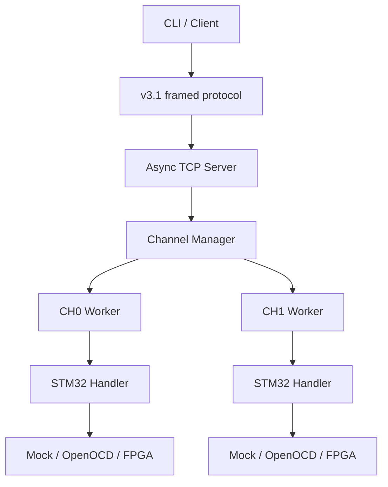
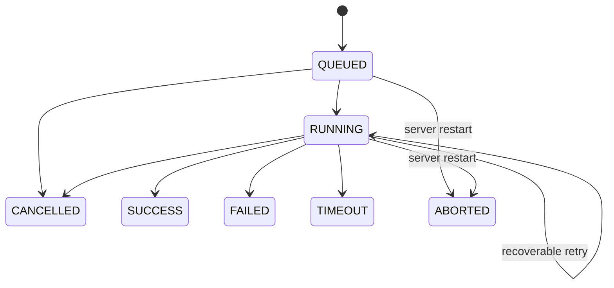
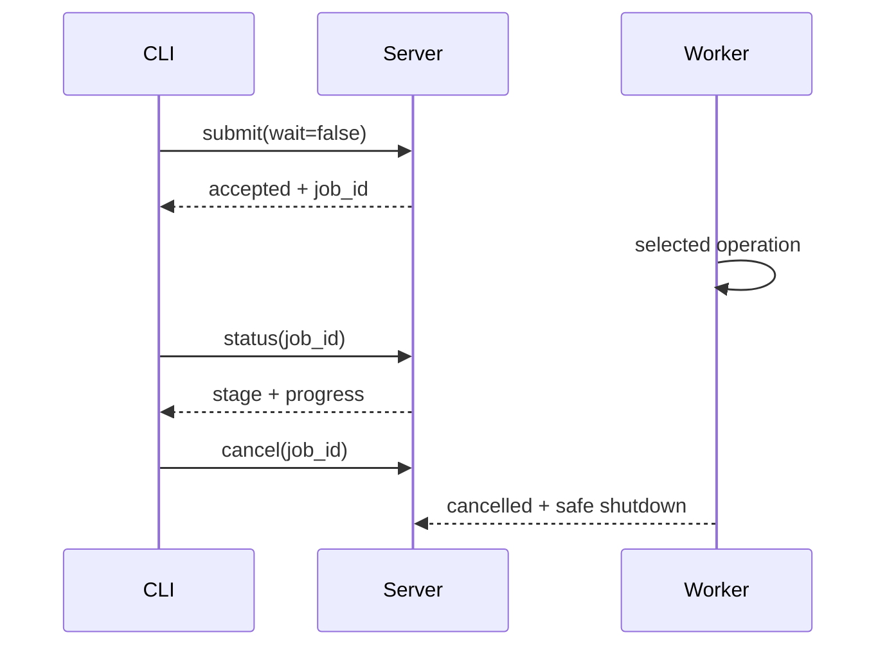

# Plasma v0.3.1 軟體架構

## 設計基準

軟體支援 1～8 通道，Prototype 設定只啟用 CH0、CH1。通道不是寫死的物件，而是由 YAML 建立。每一個 enabled channel 都擁有自己的 worker、queue、handler 與 interface instance。

## 責任邊界

| 模組 | 責任 | 不應負責 |
|---|---|---|
| `plasma_client` | 建立 request、TCP 傳輸、CLI | 通道排程與硬體操作 |
| `plasma_core` | models、errors、config、protocol、log/output | target-specific 指令 |
| `plasma_server` | 連線、Job registry、queue、worker、cancel | MCU 燒錄細節 |
| `plasma_handlers` | IC 的獨立 erase、program、verify、read 操作 | TCP、檔案路徑、AXI 位址 |
| `plasma_interfaces` | 實際硬體或 Mock 操作 | Job 排程與跨通道策略 |

## Job 生命週期

Terminal state 不會再被改為另一個結果。Server restart 只把檔案中殘留的 `queued`／`running` 改成 `aborted`，不會假設燒錄成功，也不會自動重試不確定狀態的 target。

## 進度與取消控制流

CLI 的工作 request 使用非阻塞提交模式。Server 排入 queue 後立即回傳 `job_id`，CLI 再以短連線輪詢 Job snapshot。按 `Ctrl+C` 時，CLI 不直接消失，而是送出 `cancel(job_id)`，等待 terminal state 後才結束。

目前採 polling，是為了保持 v3.1 一 request／一 response 的簡單邊界。未來 GUI 管理多台八通道燒錄器時，應改用 SSE／WebSocket 或事件匯流排，否則大量輪詢會形成不必要的連線負載。

## 並行與隔離

- 每通道一次只執行一個工作。
- 不同通道可以平行執行。
- 全域 semaphore 依 `max_concurrent_jobs` 限制實際執行數。
- cancel、timeout 與 retry 僅操作該 Job 所屬的 interface。
- 每個通道必須使用獨立 interface instance；未來 OpenOCD adapter、process 與 port 也必須獨立。
- 共用資源故障若無法隔離，硬體層必須回報 system-level fault，不能偽裝成單通道錯誤。

## 資料持久化

v0.3.1 使用檔案持久化，優點是容易檢查，缺點是高併發查詢與交易一致性有限。若進入量產或多台 Server 管理，建議把 Job metadata 移至 SQLite，再視規模評估 PostgreSQL；binary 與完整 log 仍可保留在檔案或 object storage。

## 下一階段整合順序

1. 單一 adapter + 單一 STM32 + OpenOCD。
2. 定義可重現的成功／失敗命令與 return-code mapping。
3. 兩個獨立 adapter 驗證真正平行，而非兩個 process 共用同一硬體。
4. 定義 PYNQ-Z2 register map 與 power/reset safety state。
5. 將已驗證的 RTL channel module參數化，再評估擴充至八通道。
