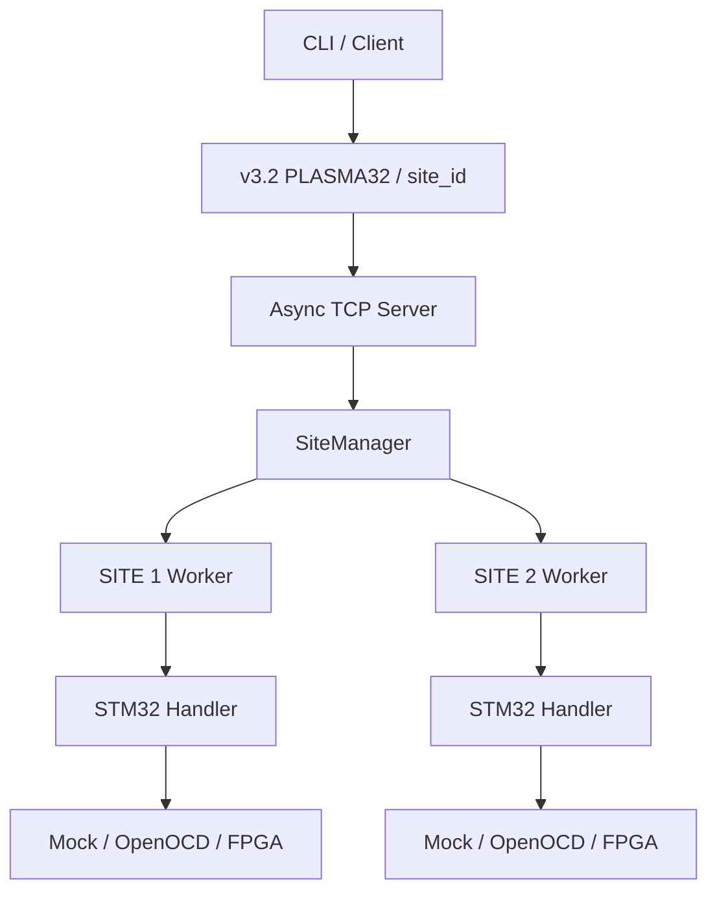
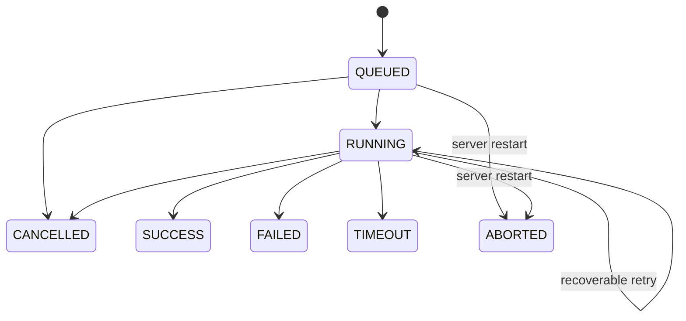
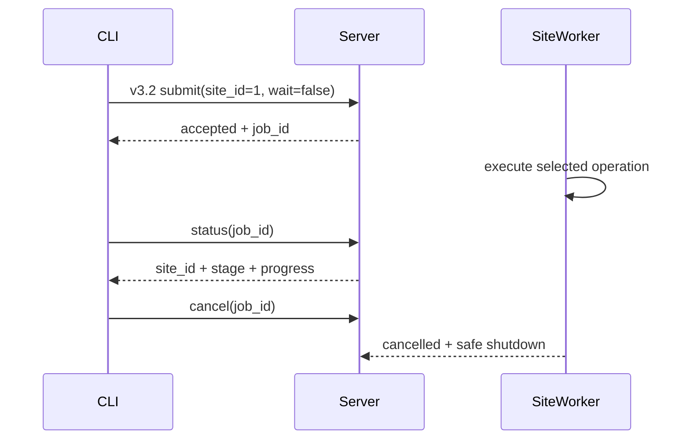

# Plasma v0.3.2 軟體架構

## 設計基準

軟體支援每台 PPU 配置 1～8 個 **Programming Sites**。Canonical Site ID 從 1 開始；Prototype 設定啟用 SITE 1、SITE 2。Site 不是寫死的物件，而是由 YAML 建立；每一個 enabled Site 都擁有自己的 worker、queue、handler 與 interface instance。



v3.1 `PLASMA31/channel_id` 只存在於 protocol compatibility adapter：`channel_id 0 -> SITE 1`。Canonical manager、worker、config、logs 與 hardware interface boundary 一律使用 one-based Site identity。

## 責任邊界

| 模組 | 責任 | 不應負責 |
|---|---|---|
| `plasma_client` | 建立 request、TCP 傳輸、CLI | Site 排程與硬體操作 |
| `plasma_core` | models、errors、config、protocol、log/output | target-specific 指令 |
| `plasma_server` | 連線、Job registry、Site queue/worker、cancel | MCU 燒錄細節 |
| `plasma_handlers` | IC 的獨立 erase、program、verify、read 操作 | TCP、檔案路徑、AXI 位址 |
| `plasma_interfaces` | 實際硬體或 Mock 操作 | Job 排程與跨 Site 策略 |
| v3.1 compatibility adapter | `channel_id 0..N-1` ↔ `site_id 1..N` | 成為第二套 domain model |

## Job 生命週期



Terminal state 不會再被改為另一個結果。Server restart 只把檔案中殘留的 `queued`／`running` 改成 `aborted`，不會假設燒錄成功，也不會自動重試不確定狀態的 target。

## 進度與取消控制流

CLI 的工作 request 使用非阻塞提交模式。Server 排入 Site queue 後立即回傳 `job_id`，CLI 再以短連線輪詢 Job snapshot。按 `Ctrl+C` 時，CLI 送出 `cancel(job_id)`，等待 terminal state 後才結束。



目前 transport 採 polling／短連線，是為了保持一 request／一 response 的明確 frame boundary。未來 Fleet/Manager 規模增加時，可再評估 SSE、WebSocket 或事件匯流排；這不影響 PPU 內部 Site 的 deterministic execution boundary。

## 並行與隔離

- 每個 Site 一次只執行一個工作。
- 不同 Sites 可以平行執行，彼此不應互相等待。
- 全域 semaphore 依 `max_concurrent_jobs` 限制真正執行數。
- cancel、timeout 與 retry 僅操作該 Job 所屬的 interface。
- 每個 Site 必須使用獨立 interface instance；未來 OpenOCD adapter、process 與 port 也必須獨立。
- 共用資源故障若無法隔離，硬體層必須回報 system-level fault，不能偽裝成單 Site 錯誤。

## Identity invariants

Canonical runtime 必須滿足：

```text
SITE 1 == site_id 1
SITE 2 == site_id 2
...
SITE N == site_id N
```

禁止在 canonical code 中建立 SITE 0，或假設 `site_id == legacy channel_id`。v3.1 adapter 的唯一映射是：

```text
channel_id = site_id - 1
site_id    = channel_id + 1
```

## 資料持久化

目前使用檔案持久化，優點是容易檢查，缺點是高併發查詢與交易一致性有限。Canonical Job log 使用 `SITE<n>` 路徑與 `site_id`；暫時的 v3.1 audit mirror 使用 `CH<n-1>` 與 `channel_id`，兩套 schema 分開寫入。Read-back binary 僅產生 `read_SITE<n>_...`，不重複建立 legacy binary。

若進入量產或多台 PPU 管理，Job metadata 可評估移至 SQLite，再視 Fleet 規模評估 PostgreSQL；binary 與完整 log 可保留在檔案或 object storage。

## 下一階段硬體整合順序

1. 單一 adapter + SITE 1 + 單一 STM32 + OpenOCD。
2. 定義可重現的成功／失敗命令與 return-code mapping。
3. SITE 1 / SITE 2 使用兩個獨立 adapter 驗證真正平行，而非兩個 process 共用同一硬體。
4. 定義 Z2 register map 與 power/reset safety state。
5. 將已驗證的 RTL Site/protocol engine 參數化，再評估擴充至八個 Sites。
